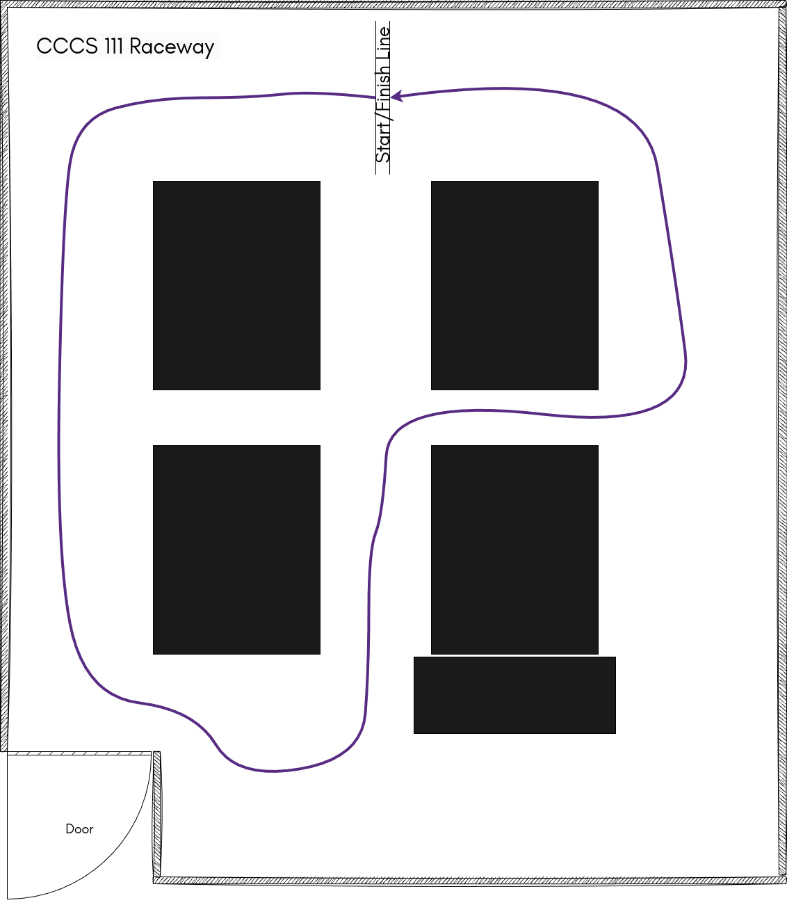

# Final Project - Deep Learning Self-Driving

## Objectives
- Develop a deep learning autopilot model based on convolutional neural networks.
- Test the autopilot on the designated track.

## Usage
1. Clone this repository to Raspberry Pi (and rename it to dlr).
```bash
cd ~
git clone git@github.com:<team_name>/<repository_name> dlr
```
2. Collect data
```bash
python ~/dlr/scripts/collect_data.py
```
3. Transfer data
```bash
rsync -rv --partial --progress ~/dlr/data/2024-11-12-13-14 user@192.168.0.111:~/dlr/data/
```
4. Log in to server
```bash
ssh user@192.168.0.111
```
5. Train model
```bash
mamba activate bc
python ~/dlr/scripts/train.py 2024-11-12-13-14
```
6. Transfer model
**Following example needs to log out from the server**.
```bash
rsync -rv --partial --progress user@192.168.0.111:~/dlr/data/AutopilotNet-15epochs-0.001lr.pth ~/dlr/models
```
7. Deploy autopilot
```bash
python ~/dlr/scripts/autopilot.py
```

## Requirements
- Design your autopilot model in [convnets.py](scripts/convnets.py). The model is suppose to take in color image with shape of `(176, 208, 3)` and output steering and throttle values with shape of `(1, 2)`. 
- Collect data to train your autopilot.
- Deploy and test the autopilot model.

## Rubric 
- The autopilot model will be tested and showcased on the race track as shown below.


- (100%) The autopilots are expected to drive the vehicles autonomously. Any human interference will take 5% off the total score. 
