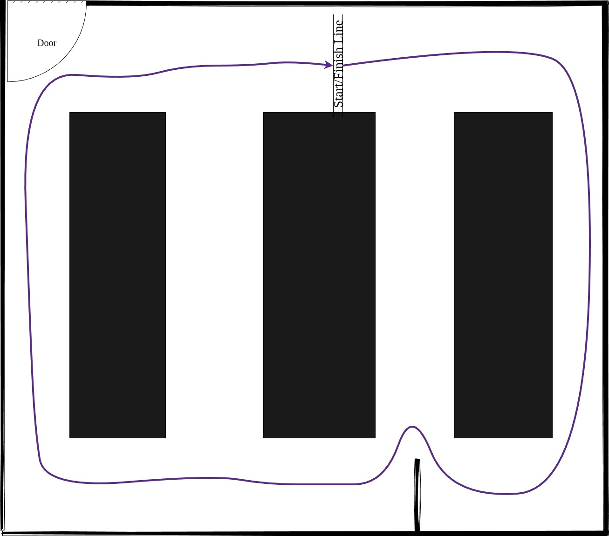

# Final Project - Deep Learning Autopilot

## Background

The rapid evolution of autonomous vehicle technology represents a paradigm shift in modern transportation, promising to drastically reduce accidents caused by human error while optimizing traffic efficiency.
Unlike traditional control systems that rely on brittle, hand-crafted rules to define driving behavior, modern autopilot systems increasingly depend on deep learning to navigate the stochastic and high-dimensional nature of real-world environments.
By leveraging architectures such as Convolutional Neural Networks (CNNs) for end-to-end learning, vehicles can move beyond simple object detection to map raw sensory inputs directly to control outputs like steering and acceleration.
This project focuses on developing such a deep learning-based autopilot, aiming to implement a behavioral cloning approach that allows the model to learn and replicate safe driving trajectories from observational data.

## Project Setup

1. Please follow the guides in BearCar's [documentation](https://ucaengineeringphysics.github.io/bearcar_docs/) to download and set up [BearCar](https://github.com/UCAEngineeringPhysics/BearCar) on both Raspberry Pi and server computer.

> [!TIP]
> Start over project setup if necessary.
> Back up important files, then `rm -rf ~/BearCar` will wipe the project out from either Raspberry Pi or server.

2. Download project repository on both Raspberry Pi and server computer.

```console
cd ~
git clone git@github.com:UCAEngineeringPhysics/deep-learning-autopilot-<team_name>.git ~/dl_autopilot
```

> [!NOTE]
>
> - You need to substitute `<team_name>` with your actual team name.
> - The downloaded project repository will be saved as `~/dl_autopilot/`.

3. Use `(width=180, height=200, color_channel=3)` as your autopilot's input image size.
This requires a little modification of the **BearCar** scripts on the **Raspberry Pi**.

- Modify image resolution on line 37 in [teleop.py](https://github.com/UCAEngineeringPhysics/BearCar/blob/scripts/teleop.py).
- Modify image resolution on line 43 in [autopilot.py](https://github.com/UCAEngineeringPhysics/BearCar/blob/scripts/autopilot.py).

4. Modify model source to use models develop by your teammembers.
This requires modification of the **BearCar**'s scripts on both **Raspberry Pi** and **server**.

- Link the autopilot architecture directory from this project repository to BearCar repository.

```console
ln -s ~/dl_autopilot/autopilot_architectures ~/BearCar/scripts/autopilot_architectures
```

- Modify line 11 and line 23 in [autopilot.py](https://github.com/UCAEngineeringPhysics/BearCar/blob/scripts/autopilot.py) to import and deploy desired model, for example:

```python
# ...
from autopilot_architectures.dummy_model import DummyPilotNet  # line 11: from autopilot_architectures.model_file_name import ModelClassName
# ...
model = DummyPilotNet()  # line 23
# ...
```

- Modify line 11, and line 145 in [learn.py](https://github.com/UCAEngineeringPhysics/BearCar/blob/scripts/learn.py) to import and use desired model

```python
# ...
from autopilot_architectures.dummy_model import DummyPilotNet  # line 11
# ...
model = DummyPilotNet().to(DEVICE)  # line 145
# ...
```

## Requirements

- (10%) Design and develop the architecture of the deep learning autopilot.
Save all teammember's model files in [autopilot_architectures/](autopilot_architectures/) directory with distinguished and identifiable names.
For example: [autopilot_architectures/dummy_model.py](autopilot_architectures/dummy_model.py)

> [!CAUTION]
>
> - Each teammember needs to propose a unique model architecture (can't be the same as the BearNet nor as anyone else's).
If a convolutional neural network is proposed, the designs of both convolution layers and fully connected layers have to be unique.
> - No credits will be given to the teammembers who failed to upload the model architecture.
> - Teammembers will share the physical robot and the server account.
> - Sharing the training data is allowed. If a teammember collected all the training data, the member will be awarded with an extra 5% of the project's total points.

- (10%) Upload the race proofed autopilot model to [models/](models/) directory with distinguished and identifiable names.

> [!CAUTION]
>
> No credits will be given to the teammembers who failed to upload the model architecture.

- (80%) Demonstrate a functional autopilot on the race day.

> [!CAUTION]
>
> - Every teammember needs to demonstrate his/her own autopilot using the shared robot.
> - Each teammember has **3 attempts** in total. Extra attempts may given based on the time and the actual conditions.
> - The autopilot is expected to finish at least one lap of the track autonomously.
> - Every collision, and human interference in one lap will lead the autopilot's owner losing 4% of total points.
> - Teammembers can share the duties of security guard and on-track correction.
>
- (Optional) Feel free to [fork](https://docs.github.com/en/pull-requests/collaborating-with-pull-requests/working-with-forks/fork-a-repo) and customize the [BearCar](https://github.com/UCAEngineeringPhysics/BearCar) repository. Submit [pull requestes](https://docs.github.com/en/pull-requests/collaborating-with-pull-requests/proposing-changes-to-your-work-with-pull-requests/about-pull-requests) if you've developed new features or corrected mistakes.

> [!TIP]
> Extra points will be rewarded to the person or teams who submitted **accepted** PRs.
  
## Race Steps

1. Set the robot behind the start/finish line under the "Paused" status (yellow light on).
2. Operator (who has the gamepad) needs to wait the judge's verbal order to start the autopilot (purple light on).
3. If human interference is needed, operator has to pause the robot and let the corrector reset the robot to where it was paused or follow the judge's order.
4. Operator has to wait the robot crossed the finish line to disable the robot.


