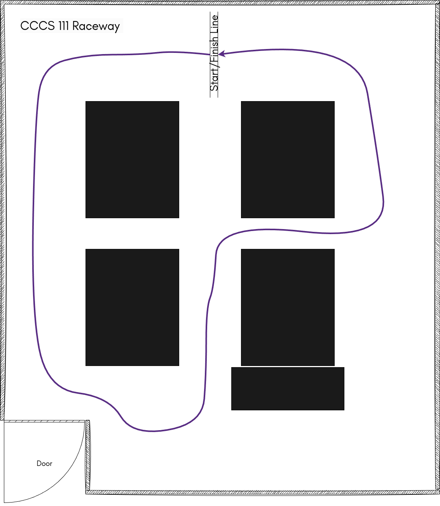

# Final Project - Deep Learning Autopilot

## Background
The rapid evolution of autonomous vehicle technology represents a paradigm shift in modern transportation, promising to drastically reduce accidents caused by human error while optimizing traffic efficiency. 
Unlike traditional control systems that rely on brittle, hand-crafted rules to define driving behavior, modern autopilot systems increasingly depend on deep learning to navigate the stochastic and high-dimensional nature of real-world environments. 
By leveraging architectures such as Convolutional Neural Networks (CNNs) for end-to-end learning, vehicles can move beyond simple object detection to map raw sensory inputs directly to control outputs like steering and acceleration. 
This project focuses on developing such a deep learning-based autopilot, aiming to implement a behavioral cloning approach that allows the model to learn and replicate safe driving trajectories from observational data.

## [BearCar](https://github.com/UCAEngineeringPhysics/BearCar) Setup

## Requirements
- Design your autopilot model in [convnets.py](scripts/convnets.py). The model is suppose to take in color image with shape of `(176, 208, 3)` and output steering and throttle values with shape of `(1, 2)`. 
- Collect data to train your autopilot.
- Deploy and test the autopilot model.

## Final Race Rubric 
- **(100%) The deployed autopilot is expected to finish at least one lap of the track autonomously.** Any human correction/interference will cost 5% of the total score.
- For the final demonstration, set and start the BearCart at the "Start/Finish Line".
- Release the autopilot after the instructor's verbal cue.
- Operators may follow and correct the robot if any unexpected situation (crash, stuck, off-track, etc.) happened. Be familiar with the `PAUSE` button.
- The time cost to finish a lap and the number of human corrections/interferences will be recorded.
- Each team has 5 attempts. Each attempt should not last over 2 minutes.
- The autopilot model will be tested and showcased on the track as shown below.

